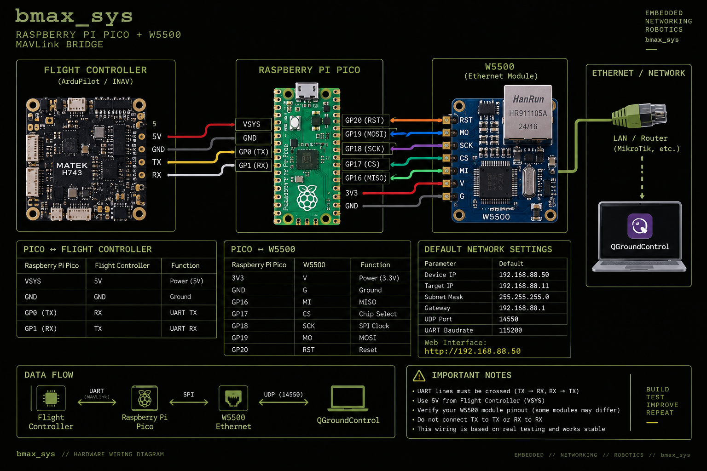
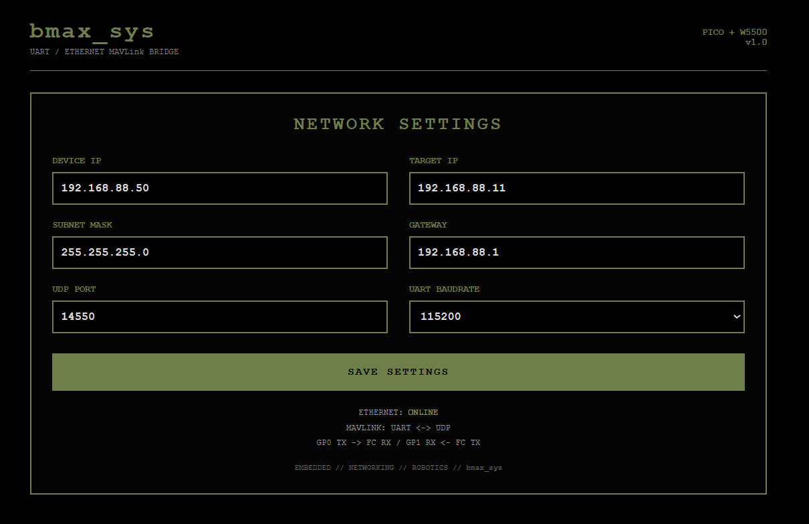

# Raspberry Pi Pico + W5500 MAVLink Bridge

UART to Ethernet MAVLink bridge based on **Raspberry Pi Pico** and **W5500** with a built-in web configuration interface.

Designed for ArduPilot-based robots, rovers and other embedded systems where MAVLink telemetry must be transferred from a flight controller over Ethernet/UDP.

## Overview

The device converts MAVLink telemetry from UART to Ethernet using the W5500 network controller.

Data path:

`Flight Controller ↔ UART ↔ Raspberry Pi Pico ↔ SPI ↔ W5500 ↔ Ethernet / UDP ↔ QGroundControl`

The project was tested with real hardware and successfully delivered MAVLink telemetry to QGroundControl.

## Features

- Raspberry Pi Pico / RP2040
- W5500 Ethernet controller
- UART to UDP MAVLink bridge
- Static network configuration
- Built-in web configuration interface
- Configurable Device IP
- Configurable Target IP
- Configurable Subnet Mask
- Configurable Gateway
- Configurable UDP Port
- Configurable UART Baudrate
- QGroundControl compatible
- ArduPilot compatible

## Hardware

- Raspberry Pi Pico
- W5500 Ethernet module
- ArduPilot flight controller
- Ethernet network
- QGroundControl

## Wiring

### Raspberry Pi Pico ↔ W5500

| Raspberry Pi Pico | W5500 |
|---|---|
| 3V3 | V |
| GND | G |
| GP16 | MI / MISO |
| GP17 | CS |
| GP18 | SCK |
| GP19 | MO / MOSI |
| GP20 | RST |

### Raspberry Pi Pico ↔ Flight Controller

| Raspberry Pi Pico | Flight Controller |
|---|---|
| VSYS | 5V |
| GND | GND |
| GP0 TX | RX |
| GP1 RX | TX |

UART lines must be crossed:

`GP0 TX → FC RX`

`GP1 RX ← FC TX`

Full wiring documentation:

[WIRING.md](docs/WIRING.md)

## Wiring Diagram



## Default Configuration

| Parameter | Default |
|---|---|
| Device IP | `192.168.88.50` |
| Target IP | `192.168.88.11` |
| Subnet Mask | `255.255.255.0` |
| Gateway | `192.168.88.1` |
| UDP Port | `14550` |
| UART Baudrate | `115200` |

## Web Interface

The bridge includes a built-in web interface for network and UART configuration.

Default address:

`http://192.168.88.50`



## MAVLink / QGroundControl

The flight controller sends MAVLink telemetry over UART.

The Raspberry Pi Pico forwards the telemetry through the W5500 Ethernet controller to the configured UDP target.

Example:

`Flight Controller → Pico → W5500 → Ethernet → UDP 14550 → QGroundControl`

During testing, QGroundControl successfully detected the vehicle and received MAVLink telemetry.

## Firmware

Firmware source:

[raspberry_pi_pico_w5500_mavlink_bridge.ino](firmware/raspberry_pi_pico_w5500_mavlink_bridge.ino)

## Testing

The following functions were successfully verified on real hardware:

- W5500 detection
- Ethernet link
- Static IP configuration
- Ping to `192.168.88.50`
- Web interface
- UART communication with flight controller
- MAVLink telemetry over Ethernet / UDP
- QGroundControl vehicle detection
- Telemetry reception

Full test documentation:

[TESTING.md](docs/TESTING.md)

## Repository Structure

```text
raspberry-pi-pico-w5500-mavlink-bridge/
├── README.md
├── firmware/
│   └── raspberry_pi_pico_w5500_mavlink_bridge.ino
└── docs/
    ├── WIRING.md
    ├── TESTING.md
    └── images/
        ├── wiring-diagram.png
        └── web-interface.jpg
```

## Notes

- Verify the voltage requirements of your specific W5500 module before connecting power.
- The tested W5500 module was powered from the Pico 3.3V pin.
- The Raspberry Pi Pico was powered from the flight controller 5V line through VSYS.
- A common ground between the Pico, W5500 and flight controller is required.
- UART TX and RX lines must be crossed.

## Status

**v1.0 — tested and working**

## Author

**bmax_sys**

Embedded • Networking • Robotics
